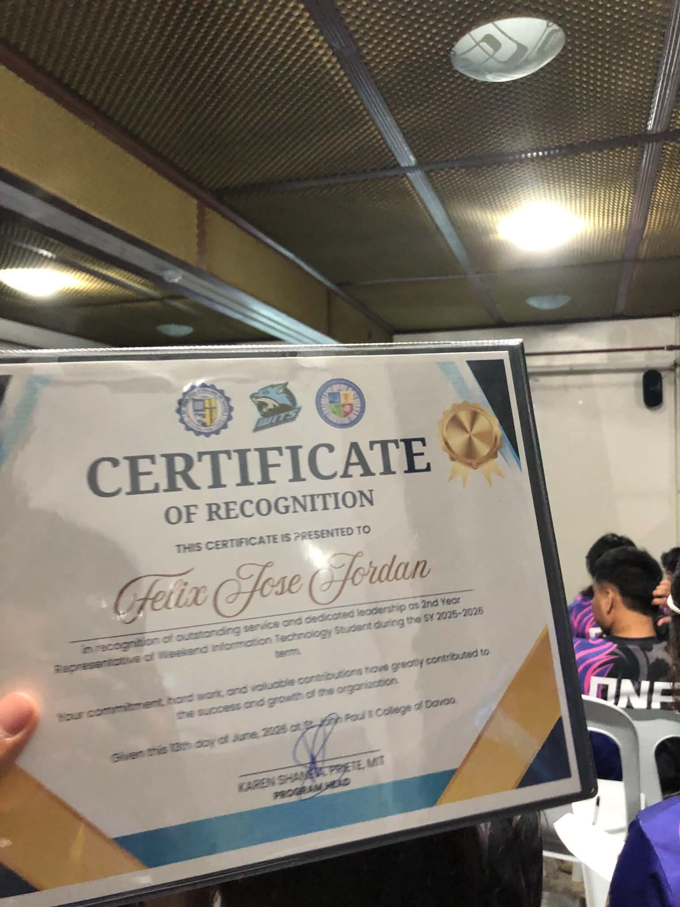

<h1 align="center">Felix Jose Jordan</h1>

  

  

  
  
  
  
  

---

## About Me

I'm **Felix Jose Jordan**, a fresh **Bachelor of Science in Information Technology (BSIT)** graduate from the Philippines, aiming to become a **Software Engineer**.

I'm at the beginner stage, and I'm honest about that. Most of what I know so far came from academic work and building small projects on my own — writing Java programs, designing a Swing desktop interface, and putting together a mobile UI prototype in Figma. What I enjoy most is the part where an idea starts as nothing and slowly becomes something that runs.

Right now I'm focused on three things: **strengthening my programming fundamentals, building practical projects I can actually explain, and learning how real developers work with Git, documentation, and clean code.** I don't have professional work experience yet, and I don't pretend to. What I do have is the habit of showing up, finishing what I start, and being clear about what I still need to learn.

- **Role I'm aiming for:** Entry-Level / Junior Software Engineer
- **Current level:** Beginner / Entry-Level Programmer
- **Education:** BSIT
- **Mindset:** Perseverance and continuous learning

---

## Tech Stack

### Languages — technologies I have worked with

These are the languages I've used in coursework and personal practice projects. I'm still building depth in each of them.

### Tools

### Design

---

## Featured Projects

| # | Project | Category | Stack | Repo |
|---|---------|----------|-------|------|
| 1 | **simple_pos** | Java Programming Project | Java · Swing | [View Repository](https://github.com/felixjordan427-gif/kemerots) |
| 2 | **JavaApplication1** | Desktop Application (GUI) | Java · Swing | [View Repository](https://github.com/felixjordan427-gif/kemerots) |
| 3 | **LookIT** | UI/UX Design | Figma | [View Prototype](https://www.figma.com/design/4FINPzTXyR00MqE3QrRefW/LookIT-Mobile-Prototype?node-id=0-1&t=USeMAP9YYHW7QzOb-1) |

> All three projects currently live in a single repository. I am in the process of giving each project its own repository and a proper README.

---

## Development Projects

### 1. simple_pos — Java Point-of-Sale Application

**Category:** Java Programming Project · **Language:** Java · **Interface:** Java Swing (desktop)

A desktop point-of-sale application I built in Java for a burger-style food stall concept. The cashier clicks menu items on screen, the order is built in a table, the running total updates automatically, and a receipt preview can be printed.

**Features (verified from the source code)**

- Six clickable menu items, each with its own image icon: bacon, burger bundle, Cjoy burger, peach mango pie, spaghetti pan, and Famduo
- Per-item quantity counters displayed on the interface
- Order table (`JTable`) with ID, Item, Qty, and Price columns
- Add-to-cart logic that merges a repeated item instead of duplicating the row
- Automatic running total, formatted with `DecimalFormat`
- Delete a selected row from the order, with its counter reset
- Receipt preview panel with store header, itemized list, subtotal, cash, and balance, sent to the printer

**Concepts demonstrated**

- Java Swing: `JFrame`, `JTable`, `DefaultTableModel`, `JButton`, `JLabel`, `JPanel`, `JTextArea`, `JScrollPane`
- Event-driven programming with `ActionListener` / `ActionEvent`
- Layout management with `GroupLayout`
- Collections (`Vector`), arrays, `for` loops, and `switch` statements
- Working with image resources and `ImageIcon`
- Number formatting and simple arithmetic for totals
- Exception handling in the print action
- Look and feel handling (Nimbus)

**Repository:** https://github.com/felixjordan427-gif/kemerots
**Demo:** [ADD DEMO] · **Screenshots:** [ADD SCREENSHOTS]

---

### 2. JavaApplication1 — First GUI Exercise

**Category:** Desktop Application / Application Development · **Language:** Java (Swing)

My first attempt at a Java GUI application, written as an academic exercise. It covers the fundamentals I was learning at the time: creating a window, adding a button, and building a menu bar with `JMenu`, `JMenuItem`, and `JMenuBar`.

**Skills demonstrated**

- Creating and displaying a `JFrame`
- Adding Swing components and positioning them
- Working with content panes and basic layout
- Menu bar construction
- Writing and structuring Java classes

**Status — work in progress:** this project is not finished. The source file currently contains unresolved errors and needs cleanup before it can be shown as a working application. I'm keeping it here because it's an honest snapshot of where I started, and I plan to rebuild it properly.

**Repository:** https://github.com/felixjordan427-gif/kemerots
**Screenshots:** [ADD SCREENSHOTS] · **Demo:** [ADD DEMO]

---

### 3. LookIT — Mobile UI/UX Prototype

**Category:** UI/UX Design · **Tool:** Figma

A mobile interface prototype I designed in Figma, covering the full design process from screen layout to an interactive prototype.

**Skills demonstrated**

- Figma
- UI/UX design
- Mobile interface design
- Prototyping and user interaction design
- Product concept development

**Prototype:** [View Figma Prototype](https://www.figma.com/design/4FINPzTXyR00MqE3QrRefW/LookIT-Mobile-Prototype?node-id=0-1&t=USeMAP9YYHW7QzOb-1)
**Screenshots:** [ADD SCREENSHOTS] · **Description of the app itself:** [NEEDS VERIFICATION — what LookIT does]

---

## Web Development

I'm currently building web-based projects to get comfortable with HTML, CSS, and JavaScript — structuring pages, styling layouts, and adding interactive behavior with plain JavaScript.

- **In progress:** a browser-based to-do list application using HTML, CSS, and JavaScript with browser `localStorage` persistence — [ADD REPOSITORY]
- **Focus areas:** semantic HTML, responsive layout with CSS Grid and Flexbox, DOM events, and client-side state handling

---

## Currently Learning

- **Programming fundamentals** — logic, loops, methods, arrays, and data structures across C++, C#, Java, and PHP
- **Web development** — HTML structure, CSS layout, and JavaScript fundamentals
- **Software engineering concepts** — separation of concerns, basic algorithms, and debugging habits
- **Git and GitHub workflow** — branches, commits, README documentation, and keeping project history clean
- **Building practical applications** — turning ideas into programs that actually run end to end
- **Project documentation** — writing clear READMEs and honest descriptions of what a project does
- **Clean and maintainable code** — naming, structure, and removing dead or unfinished code

---

## Developer Mindset

For me, software development is a loop, not a straight line:

**Learn → Build → Get it wrong → Understand what broke → Improve → Try again → Repeat.**

Most of what I've learned came from broken builds and logic errors, not from tutorials going smoothly. I'm at the stage where the bugs are still frequent, but I'm getting faster at reading error messages, tracing problems, and understanding *why* something failed instead of just copying a fix.

What I bring as a junior candidate is persistence and honesty: I know what I've built, I know what I haven't, and I'm comfortable saying "I don't know this yet."

---

## Certificates

| Certificate | Issued By | Date |
|-------------|-----------|------|
| [ADD CERTIFICATE NAME] | [ADD ISSUING SCHOOL / ORGANIZATION] | [ADD DATE] |

---

## Contact / Links

| Platform | Link |
|----------|------|
| GitHub | https://github.com/felixjordan427-gif |
| Email | felixjordan427@gmail.com |
| Figma | [LookIT Prototype](https://www.figma.com/design/4FINPzTXyR00MqE3QrRefW/LookIT-Mobile-Prototype?node-id=0-1&t=USeMAP9YYHW7QzOb-1) |
| Project Repository | https://github.com/felixjordan427-gif/kemerots |
| Tagay Shop OOP Documentation | [Link](https://www.facebook.com/share/v/18Q2rcyDLs/) |
| LinkedIn | [ADD LINK] |
| Personal Portfolio | [ADD LINK] |

---

  Built with curiosity and a lot of trial and error.

# jepoy

